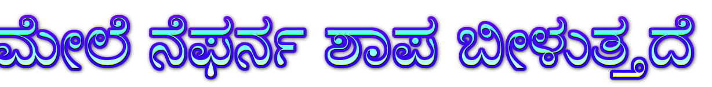

#Actividad 1

Lenguaje.
Un lenguaje (del provenzal lenguatge1​ y del latín lingua) es un sistema de comunicación estructurado para el que existe un contexto de uso y ciertos principios combinatorios formales. Existen contextos tanto naturales como artificiales.

Lenguaje de programacion

Un lenguaje de programación es un lenguaje formal que proporciona una serie de instrucciones que permiten a un programador escribir secuencias de órdenes y algoritmos a modo de controlar el comportamiento físico y lógico de una computadora con el objetivo de que produzca diversas clases de datos.

Algoritmo.
Conjunto ordenado de operaciones sistemáticas que permite hacer un cálculo y hallar la solución de un tipo de problemas

Algoritmos cotidianos.
Son acciones que se realizan de manera comun, las cuales llevan una seri de pasos a seguir

Lenguajes Algoritmicos.
Es una serie de símbolos y reglas que se utilizan para describir de manera explícita un proceso
